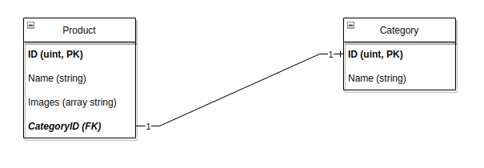
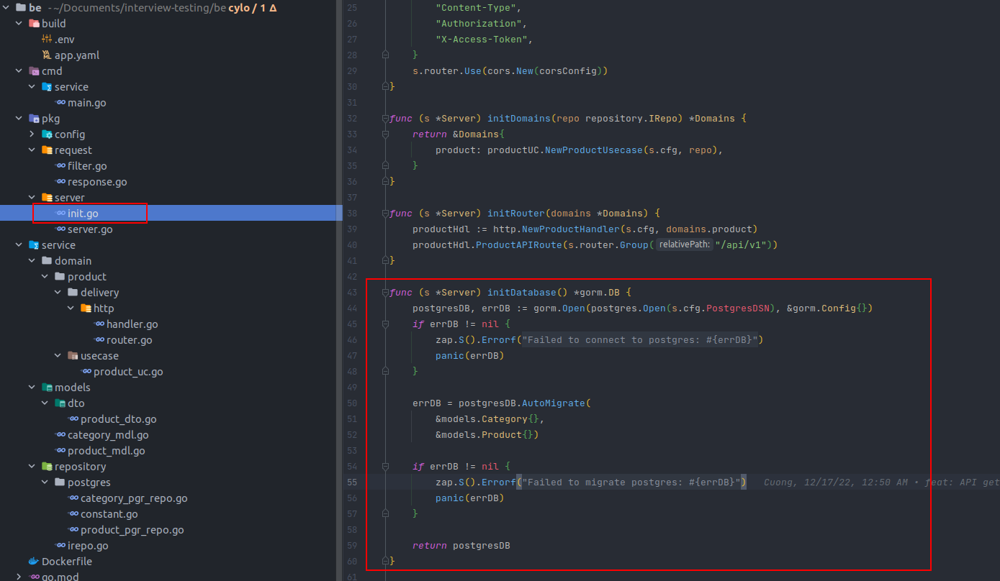
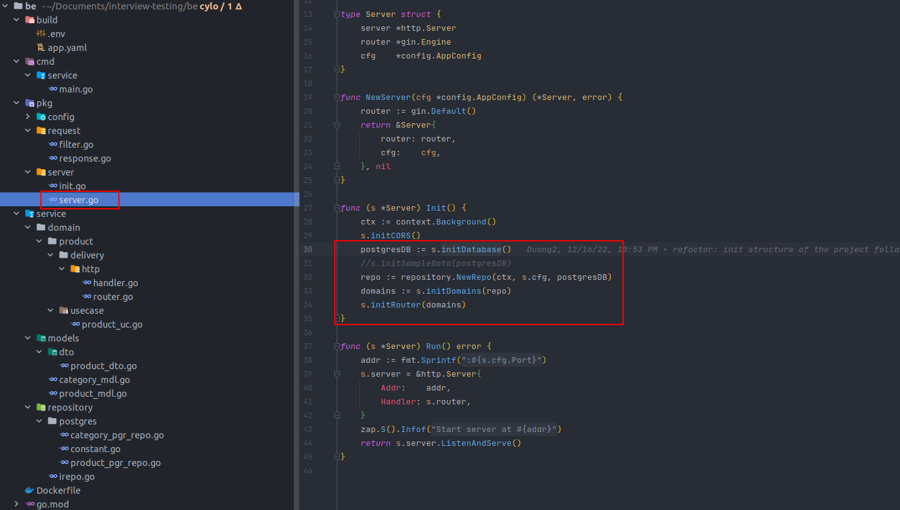
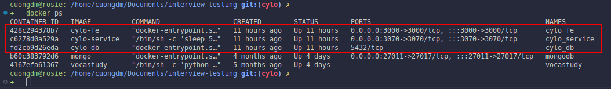
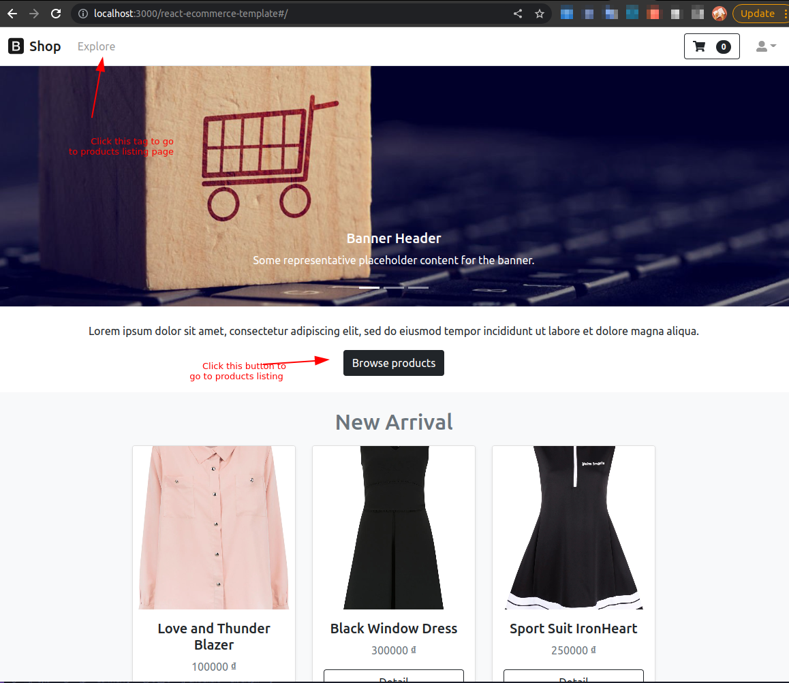
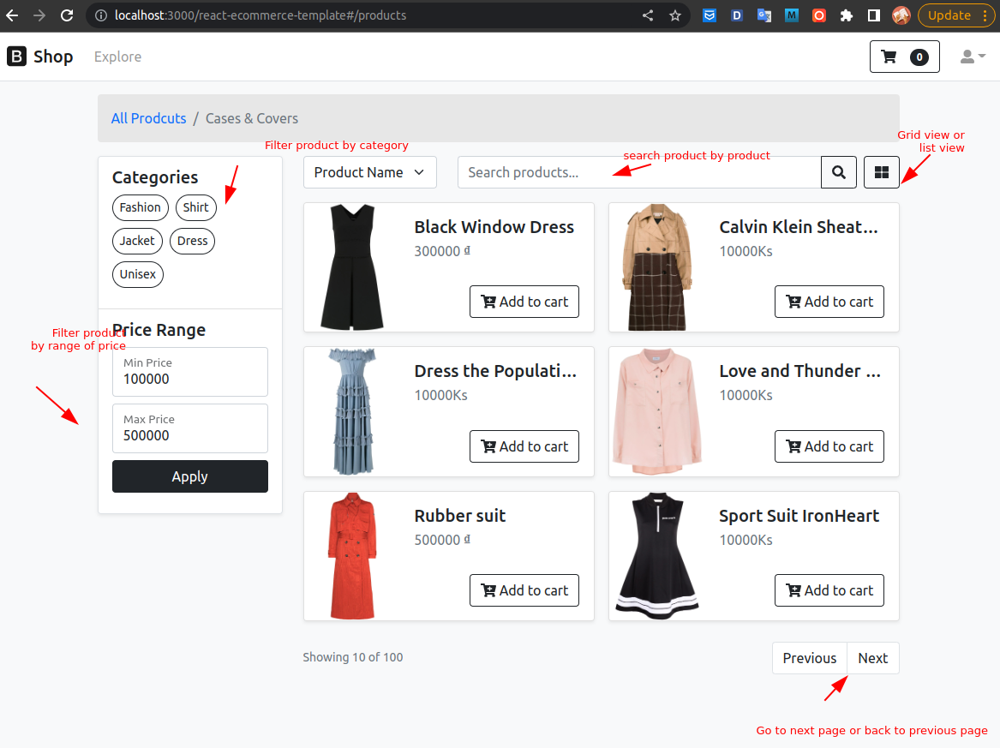

* On the FE side, I use this repo to implement the Web Interface by ReactJS: [https://github.com/phyohtetarkar/react-ecommerce-template](https://github.com/phyohtetarkar/react-ecommerce-template)
# a. Testing
* I use Python to test my entire API. Follow this link to catch it. [unit_test.ipynb](./unit_test.ipynb)

# b. Structure of project
* I implement the project by using the following structure: 
  
* The source code of BE site was implemented in the **be** directory. 
  
* I use Clean Architecture to implement the project. Personally, Clean Architecture divides clearly the business problem and code techniques, supposed that one day you do not want to use PostgreSQL anymore, or implement gRPC to your service, your main job is easy to remove or add these features, and the remaining features will be not affected.. 
  

# c. Design
## 1. Database Design

## 2. Design pattern
* This is a small project, so I only use Singleton pattern to implement the project. I use Singleton pattern to implement the database connection, and the database connection is a global variable, so I can use it in any place of the project. I am also use it to store configurable variables and then deliver it to entire my project.
* At here, I create a database connection.
  

* And then, I deliver it to the entire repository layer.
  

# d. Frameworks, and Tools
* Golang 1.18.
* Gin Gonic: [https://github.com/gin-gonic/gin](https://github.com/gin-gonic/gin)
  * Gin is a web framework written in Go (Golang). It features a martini-like API with much better performance -- up to 40 times faster.
* GORM: [https://gorm.io](https://gorm.io/)
  * The fantastic ORM library for Golang, aims to be developer friendly. You can easly build your structure of database without direactly interacting with SQL.
* PostgreSQL: [https://www.postgresql.org](https://www.postgresql.org/)
  * I use PostgreSQL because it is a powerful, open source object-relational database system. It also have advanced data types to store complex data, and it is easy to use.
* Docker, and docker-compose: I use it in my project because I want you to run the project easily without installing any dependencies.

# e. How to run the project
* I use docker-compose to run the project. You can run the project by using the following command `docker-compose up -d` at the root directory of the project.
* Or if you installed `make` tool before, run `make dc_up` to run the project.
* After you run the project by docker-compose, it will run 3 service, `cylo_db`, `cylo_service`, and `cylo_fe`. Using `docker ps` to check the status of the containers.
  
* After running the project, you can access the website by using the following URL: [http://localhost:3000/react-ecommerce-template#](http://localhost:3000/react-ecommerce-template#/) or [http://localhost:3000/react-ecommerce-template#/products](http://localhost:3000/react-ecommerce-template#/products) to see the list of products.
  
  